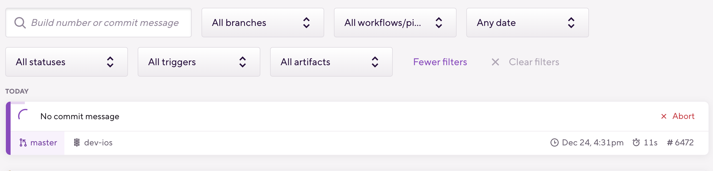

# Bitrise Client for VSCode

This VSCode extension, Bitrise Client, enables users to manage Bitrise build pipelines directly from within Visual Studio Code. It simplifies interactions with Bitrise for continuous integration and deployment right from your code editor.

## Features

- **Start Builds**: Initiate Bitrise builds for the current Git branch.
  - Workflow Selection: Choose from available Bitrise workflows to start your build.
  - 
  - 
- **Configuration Management**: Manage your Bitrise API token and application slug through VSCode settings.

## Requirements

- A Bitrise account with an active project.
- An API token from Bitrise for authentication.
- The application slug of your Bitrise project.


## Extension Settings

This extension contributes the following settings:

- `bitriseClient.apiToken`: Your Bitrise API token.
- `bitriseClient.defaultAppSlug`: The default application slug for your Bitrise app.

```workspace.json
{
  "bitrise-client.apiToken": "xxxxx",
  "bitrise-client.defaultAppSlug": "xxxxxxx",
}
```

## Known Issues

No known issues at the moment. If you encounter any problems, please report them on the GitHub issue tracker.

## Release Notes

### 0.0.1

Initial release of Bitrise Client for VSCode:

- Feature: Start Bitrise builds directly from VSCode.
- Feature: Select workflows from available Bitrise workflows.
